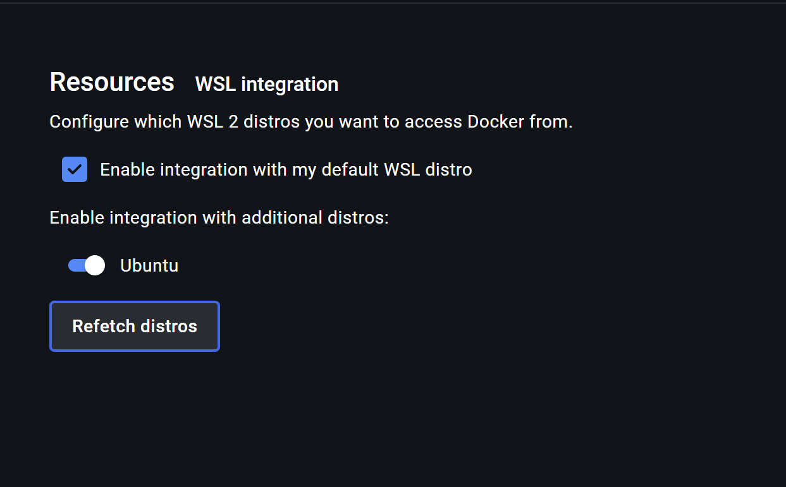

# Flo V2 (No grippers) Control Stack for Aim 1 Inperson Robot (IR) AO experiments

This repo contains code to build and run a Docker container on a WSL environment (Ubuntu-24.04) on Windows machine. The ROS Docker container is used to run the control stack for the robot (no grippers) for the Aim 1 AO trials and control the chest LED. This control stack also communicate with a Python program running on Windows (outside Docker container) through MQTT, receiving commands (LED states and robot actions) to control the robot and the LED. This robot system doesnt have camera or computer vision components.

## Repository Structure

* flo_core
* flo_humanoid
* flov2_robot_description

## Prerequisites

##### 1. Install WSL2 + Ubuntu 24.04 LTS

- Open PowerShell as Administrator and install WSL2:

  ```powershell
  wsl --install
  wsl --set-default-version 2
  ```
- Install Ubuntu 24.04:

  ```powershell
  wsl --install -d Ubuntu-24.04
  ```

  Create your UNIX username/password on first launch.
- (Recommended) Update WSL kernel:

  ```powershell
  wsl --update
  ```
- Verify in Windows:

  ```powershell
  wsl -l -v     # VERSION should be 2 for Ubuntu
  ```

  Verify in WSL:

  ```bash
  uname -r      # should contain "microsoft-standard-WSL2"
  cat /etc/os-release  # should show Ubuntu 24.04
  ```

##### 2. Install Docker Desktop

- Download: [Docker Desktop](https://www.docker.com/products/docker-desktop/)
- Reboot after installation
- Ensure Docker is running (whale icon in the system tray)

  Notes: Please enable **WSL 2 based engine** and **Integration with my default WSL distro** options in the Docker Desktop settings,

  

  

##### 3. Install usbipd-win (PowerShell as Admin)

```
winget install --interactive --exact dorssel.usbipd-win   
```

In WSL Ubuntu, install USB tools and configure the usbip

```
sudo apt update && sudo apt upgrade -y
sudo apt install -y linux-tools-generic hwdata usbutils
sudo update-alternatives --install /usr/local/bin/usbip usbip /usr/lib/linux-tools/*-generic/usbip 20
usbip version
```

##### 4. Install VcXsrv (Windows X Server)

- Downloads：https://sourceforge.net/projects/vcxsrv/
- Launch XLaunch，in configuration：

  - **Multiple windows**
  - **Start no client**
  - **Disable access control**

## USB pass-through (Windows → WSL)

* First bind the busid of your hardware:

  ```
   usbipd list
   usbipd bind --busid <BUSID>   # Example: 1-1（U2D2）、1-2（C920）
  ```
* Create a simple attach script (PowerShell as Admin), example attach_device.ps1:

  ```
  # Auto-attach by hardware-id (more stable than BUSID)
  usbipd attach --wsl --hardware-id 0403:6014   # U2D2
  usbipd attach --wsl --hardware-id 046d:08e5   # C920
  # attach any extra devices by using hardware id
  Start-Job { usbipd attach --wsl --hardware-id 0403:6014 --auto-attach }
  Start-Job { usbipd attach --wsl --hardware-id 046d:08e5 --auto-attach }
  usbipd list
  ```
* In WSL, verify devices:

  ```
  ls /dev/ttyUSB* /dev/ttyACM*
  sudo chmod 666 /dev/ttyUSB0 /dev/ttyACM0
  ```

  Expected binding results:

```
/dev/ttyACM0 is idVendor==16c0 and idProduct==0483 (Teensyduino / USB Serial device).
/dev/ttyUSB0 is idVendor==0403 and idProduct==6014 (FTDI / USB Serial Converter).
```

## Build and run Docker (WSL)

* Clone this repo to `C:\Users\<username>\git`
* Build image at project root (with top-level Dockerfile) - **Replace the name of image with yours**

  ```
  cd /mnt/c/Users/<path_to_repo>
  docker build -t flo_v2_image_aim1 . 
  ```
* Run container with devices and X11 (start VcXsrv on Windows first):

  ```
  export DISPLAY=$(grep nameserver /etc/resolv.conf | awk '{print $2}'):0
  export QT_X11_NO_MITSHM=1
  docker run -it --name flo_v2_aim1 --privileged --device=/dev/ttyUSB0:/dev/ttyUSB0 --device=/dev/ttyACM0:/dev/ttyACM0 -e DISPLAY=host.docker.internal:0 -e QT_X11_NO_MITSHM=1 -e LIBGL_ALWAYS_INDIRECT=1 -p 1883:1883 -p 11311:11311 -p 8080:8080 flo_v2_image_aim1
  ```
* To enter exist and running docker container, run:

  ```
  docker exec -it <your container name> bash
  ```
* To enter exist but not running docker container, run:

  ```
  docker start -ai <your container name>
  ```

**Tips:**

* to change to root user, run `sudo -i`
* to copy files/folders from local repo (host) to docker container, run `docker cp <host_file_path> <container_name>:<container_path>` or `docker cp ./mylocalfolder mycontainer:/path/within/container/`

## Test run motors (inside the container)

```bash
source /opt/ros/noetic/setup.bash
source /catkin_ws/devel/setup.bash
roslaunch flo_humanoid read_write_arms.launch
```

If you see "Failed to open the port!":

- Ensure `/dev/ttyUSB0` exists in host and is mapped with `--device`.
- Grant permission: `sudo chmod 666 /dev/ttyUSB0` (host WSL once per session).
- If the host device is `/dev/ttyUSB1`, map it as `--device=/dev/ttyUSB1:/dev/ttyUSB0`.

## MQTT

* To initiate MQTT broker which runs inside the Docker container: `docker exec -u 0 -it flo_v2_aim1 bash -lc "mosquitto -v -p 1883"`
* Use scripts in `flo_core\scripts\test` to test MQTT communication between Windows and Docker container

## Commands to test in Linux

- Start ROS master:

  ```
  roscore
  ```
- Start the MQTT broker inside the container (keep this running):

  ```
  mosquitto -v -p 1883
  ```
- Launch the Gazebo sim + MoveIt + RViz:

  ```
  roslaunch flo_core full_robot_arm_sim.launch show_gz_gui:=false show_rviz_gui:=false
  ```
- Launch the hardware bridge, but disable joint_state_publisher when Gazebo is running:

  ```
  roslaunch flo_humanoid dual_arm_hardware.launch publish_joint_states:=false
  ```
- Start the MQTT control node (connects to the broker):

  ```
  rosrun flo_core mqtt_control_node.py
  ```
- Send a test movement command:

  ```
  mosquitto_pub -h localhost -t ros/mqtt/movement -m "0"
  ```

If you meet error "Name or service not know", run:

```
MQTT_BROKER_HOST=localhost rosrun flo_core mqtt_control_node.py
```

## Testing 

Use test scripts `tests/check_multiple_action_time_in_linux.sh` and `tests/check_multiple_action_time_in_linux.sh` 

## Bring up robot (main)

Run `tmux_robot_bringup_legacy.sh`
