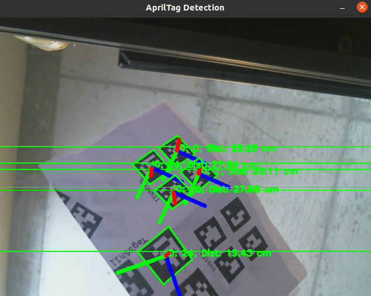

# AprilTag Detector Docker Project

## Overview

This project leverages a USB camera feed alongside AprilTag detection technology to determine the position, distance, and pose of AprilTags in the camera's field of view. The system runs within a Docker container, which simplifies setup and ensures consistency across different machines.

### Key Features

- Detection of AprilTag positions, distances, and poses using a USB camera.
- Docker integration for easy setup and deployment.
- Real-time display of detection results.
- Storage of AprilTag information through ROS topics `/apriltag_info` and `/apriltag_poses`.

## How to Use

Follow these step-by-step instructions to get the AprilTag Detector running on your system.

### Setup and Initial Run

1. **Build the Docker Image**
   Open a terminal and execute the following script to build the Docker image:
   ```bash
   ./build_Docker_Apriltag_Detector_Demo.sh
   ```

2. **Run the Docker Container**
   After building the image, start the Docker container with:
   ```bash
   ./run_Docker_AprilTagDetector.sh
   ```

3. **Start ROS Core**
   Within the same terminal, start a new `tmux` session to manage multiple processes easily:
   ```bash
   tmux
   ```
   Then start the ROS core:
   ```bash
   roscore
   ```

### Running the Detection

4. **Start the USB Camera Feed**
   Open a new terminal pane in `tmux` by pressing `Ctrl+b` followed by `c`. In the new pane, run:
   ```bash
   ./runUSBCamera.sh
   ```

5. **Run the AprilTag Detection**
   Again, open another new terminal pane in `tmux` by pressing `Ctrl+b` followed by `c`. Start the AprilTag detection with:
   ```bash
   ./run_apriltag_detector_demo.sh
   ```

### Viewing the Results

Now, the system should be operational, and you can view the window showing the AprilTag detection results.


### Topics

1. **/apriltag_poses**
   - **Type**: `geometry_msgs/Pose`
   - **Description**: Publishes the 3D pose (position and orientation) of detected AprilTags. Useful for spatial analyses and interactions in 3D environments.

2. **/apriltag_info**
   - **Type**: `std_msgs/String`
   - **Description**: Provides a string with detailed information about each detected AprilTag, including its ID, position, and orientation. Ideal for logging, debugging, and simple text-based processing.

## Additional Information

Ensure that your USB camera is properly connected and configured to be accessible by the Docker container. The scripts provided assume that all necessary permissions and access rights are set correctly. Refer to the Docker and ROS documentation for more details on configuration and troubleshooting.