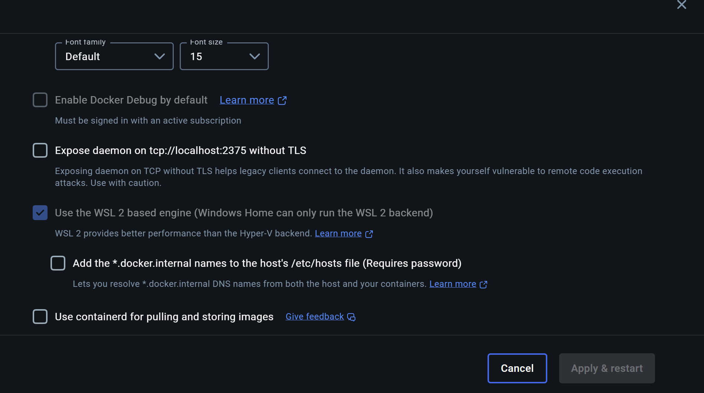

# Run FLO v2 ROS Environment on Windows

## Prerequisites

##### 1. Install WSL2 + Ubuntu 24.04 LTS

- Open PowerShell as Administrator and install WSL2:

  ```powershell
  wsl --install
  wsl --set-default-version 2
  ```
- Install Ubuntu 24.04:

  ```powershell
  wsl --install -d Ubuntu-24.04
  ```

  Create your UNIX username/password on first launch.
- (Recommended) Update WSL kernel:

  ```powershell
  wsl --update
  ```
- Verify in Windows:

  ```powershell
  wsl -l -v     # VERSION should be 2 for Ubuntu
  ```

  Verify in WSL:
  ```bash
  uname -r      # should contain "microsoft-standard-WSL2"
  cat /etc/os-release  # should show Ubuntu 24.04
  ```

##### 2. Install Docker Desktop

- Download: [Docker Desktop](https://www.docker.com/products/docker-desktop/)
- Reboot after installation
- Ensure Docker is running (whale icon in the system tray)

  Notes: Please enable **WSL 2 based engine** and **Integration with my default WSL distro** options in the Docker Desktop settings,

  

  

##### 3. Install usbipd-win (PowerShell as Admin)

```
winget install --interactive --exact dorssel.usbipd-win   
```

In WSL Ubuntu, install USB tools and configure the usbip

```
sudo apt update && sudo apt upgrade -y
sudo apt install -y linux-tools-generic hwdata usbutils
sudo update-alternatives --install /usr/local/bin/usbip usbip /usr/lib/linux-tools/*-generic/usbip 20
usbip version
```

##### 4. Install VcXsrv (Windows X Server)

- Downloads：https://sourceforge.net/projects/vcxsrv/
- Launch XLaunch，in configuration：

  - **Multiple windows**
  - **Start no client**
  - **Disable access control**

## USB pass-through (Windows → WSL)

* First bind the busid of your hardware:

  ```
   usbipd list
   usbipd bind --busid <BUSID>   # Example: 1-1（U2D2）、1-2（C920）
  ```
* Create a simple attach script (PowerShell as Admin), example attach_device.ps1:

  ```
  # Auto-attach by hardware-id (more stable than BUSID)
  usbipd attach --wsl --hardware-id 0403:6014   # U2D2
  usbipd attach --wsl --hardware-id 046d:08e5   # C920
  # attach any extra devices by using hardware id
  Start-Job { usbipd attach --wsl --hardware-id 0403:6014 --auto-attach }
  Start-Job { usbipd attach --wsl --hardware-id 046d:08e5 --auto-attach }
  usbipd list
  ```
* In WSL, verify devices:

  ```
  ls /dev/ttyUSB* /dev/video*
  sudo chmod 666 /dev/ttyUSB0 /dev/video0
  sudo apt install -y v4l-utils
  v4l2-ctl -d /dev/video0 --list-formats-ext
  ```

Notes: If /dev/video0 is still missing, try toupdate WSL kernel (wsl --update) and re-attach.

## Build and run Docker (WSL)

* Build image at project root (with top-level Dockerfile):
  **Replace the name of image with yours**

  ```
  cd /mnt/c/Users/17187/Desktop/Flo_Project/FloV2.1/FloSystemV2/gazebo_simulation_and_control
  docker build -t flo_v2_image_test . 
  ```
* Run container with devices and X11 (start VcXsrv on Windows first):

  ```
  export DISPLAY=$(grep nameserver /etc/resolv.conf | awk '{print $2}'):0
  export QT_X11_NO_MITSHM=1
  docker run -it --name flo_v2 --privileged --device=/dev/ttyUSB0:/dev/ttyUSB0 --device=/dev/video0:/dev/video0 -e DISPLAY=host.docker.internal:0 -e QT_X11_NO_MITSHM=1 -e LIBGL_ALWAYS_INDIRECT=1 -p 1883:1883 -p 11311:11311 -p 8080:8080 flo_v2
  ```
* To enter exist and running docker container, run:

  ```
  docker exec -it <your container name> bash
  ```
* To enter exist but not running docker container, run:

  ```
  docker start -ai <your container name>
  ```

## Run motors and AprilTag (inside the container)

### Motors

```bash
source /opt/ros/noetic/setup.bash
source /catkin_ws/devel/setup.bash
roslaunch flo_humanoid read_write_arms.launch
```

If you see "Failed to open the port!":

- Ensure `/dev/ttyUSB0` exists in host and is mapped with `--device`.
- Grant permission: `sudo chmod 666 /dev/ttyUSB0` (host WSL once per session).
- If the host device is `/dev/ttyUSB1`, map it as `--device=/dev/ttyUSB1:/dev/ttyUSB0`.

### AprilTag via flo_vision (camera + detection)

```bash
source /opt/ros/noetic/setup.bash
source /catkin_ws/devel/setup.bash
roslaunch flo_vision test_Apriltag_detection.launch \
  video_device:=/dev/video0 width:=640 height:=480 pixel_format:=yuyv
# Once stable, you can try 1280x720 + mjpeg
```

### AprilTag via apriltag_ros (alternative, robust)

Your camera topic may be `/usb_cam/usb_cam/image_raw`.

```bash
source /opt/ros/noetic/setup.bash
roslaunch apriltag_ros continuous_detection.launch \
  camera_name:=usb_cam image_topic:=/usb_cam/usb_cam/image_raw
```

Verify topics and detections:

```bash
rostopic list | grep -E 'usb_cam|tag'
rostopic hz /usb_cam/usb_cam/image_raw
rostopic echo -n 5 /tag_detections
```

## Daily quick start

1. Start Docker Desktop (and VcXsrv if you need GUI windows).
2. PowerShell (Admin): run your attach script (usbipd auto-attach for U2D2/camera).
3. In WSL:
   ```bash
   ls /dev/ttyUSB* /dev/video*
   sudo chmod 666 /dev/ttyUSB0 /dev/video0
   ```
4. Start your container:
   ```bash
   docker start -ai flo_v2_container
   ```
5. Inside the container:
   ```bash
   source /opt/ros/noetic/setup.bash
   source /catkin_ws/devel/setup.bash
   # Motors
   roslaunch flo_humanoid read_write_arms.launch
   # Or vision (pick one):
   roslaunch flo_vision test_Apriltag_detection.launch video_device:=/dev/video0 width:=640 height:=480 pixel_format:=yuyv
   # or
   roslaunch apriltag_ros continuous_detection.launch camera_name:=usb_cam image_topic:=/usb_cam/usb_cam/image_raw
   ```

## Troubleshooting

- Camera busy / no frames:
  - Close Windows apps using camera (Camera/Zoom/Teams/Browser), then re-run `usbipd attach`.
  - Try lower resolution + `yuyv` and `io_method:=read` for `usb_cam`.
- Topic mismatch:
  - Use `rostopic list` to get the exact image topic and pass it to `apriltag_ros` as `image_topic:=...`.
- Serial port not opening:
  - Ensure `/dev/ttyUSB0` exists and is mapped, `sudo chmod 666 /dev/ttyUSB0`, remap if the host device number changed.
- BUSID changes across ports/PCs:
  - Prefer `--hardware-id` with `--auto-attach` in `usbipd` instead of hardcoding BUSID.
- GUI doesn’t show:
  - Start VcXsrv (XLaunch), set `DISPLAY` and `QT_X11_NO_MITSHM`, mount `/tmp/.X11-unix` into the container.
