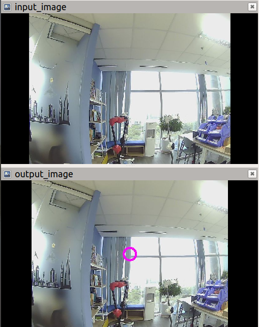

# Docker Build Repo
This repository contains build files for building ROS docker images to use 2 RGB cameras of Ohmnilab robots: the main camera (facing forward) and the aux camera (facing downward).

We use opensource ROS camera drivers:
* libuvc backend: http://wiki.ros.org/libuvc_camera  
* v4l2 backend (standalone): http://wiki.ros.org/usb_cam 
* v4l2 backend (gstreamer): http://wiki.ros.org/gscam 

Using these packages will help you quickly access the color frame directly. But there are several [limitations listed below](https://gitlab.com/ohmni-sdk/docker-ohmni-rgbcamera/-/tree/master#limitations).

# Build Images
Requirements:
 * Host enviroment: Ubuntu 18.04, amd64
 * Docker engine installed on the host machine: [Install instruction](https://docs.docker.com/install/linux/docker-ce/ubuntu/)

To build these images, change the _DOCKER_SERVER_ variable in the _build_all.sh_ file to your publish registry and run:
```
in the repo> ./build_all.sh
```
This will build 2 images:
* $DOCKER_SERVER:base_ros: install all necessary dependencies (ROS, OpenCV, )
* $DOCKER_SERVER:launch_ros: add launch files and deploy scripts

We rebuilt these images in the [this repo](https://hub.docker.com/repository/docker/baoden/ohmni_rgbcam_ros), you could give it a try first and then build your modified version.

# Basic Usage
**Step 1:** Pull the image into the bot (Ohmni developer edition)

Build your images or try our prebuild images, then adb or ssh to the bot, pull the image:
```
host computer$  adb connect [bot ip] && adb shell
bot cli: /$ su
bot cli: /# docker pull baoden/ohmni_rgbcam_ros:launch_ros
```
**step 2:** run the image and access the main tmux session (make sure you don't open the camera by any app)
```
bot cli: /$ su
bot cli: /# docker run -it --privileged --network host -v /dev:/dev  baoden/ohmni_rgbcam_ros:launch_ros bash 
```
You now accessed the docker container CLI, you can access the tmux session where all nodes and roscore are running
```
docker cli: /# tmux attach -t work
```
By default for this image, we open the main camera: 640x480@30Hz yuyv format. Check if the image stream is already published:
```
docker cli: /# rostopic hz /main_cam/image_raw

## output something like this:
subscribed to [/main_cam/image_raw]
average rate: 29.896
	min: 0.031s max: 0.037s std dev: 0.00192s window: 30
average rate: 29.826
	min: 0.031s max: 0.037s std dev: 0.00197s window: 60
average rate: 29.846
	min: 0.031s max: 0.037s std dev: 0.00196s window: 90
average rate: 29.843
	min: 0.031s max: 0.037s std dev: 0.00196s window: 119
average rate: 29.851
```
We provided several launch files of different packages in the root dirrectory of the containner, you could try these and change the default launch code (_/ros_launch.sh_).
# Example: write a simple ROS node to process the stream
**Requirement**: 

please head to http://wiki.ros.org/ROS/Tutorials to complete basic tutorials of how to create a workspace, a ROS node that subcribe to the image stream

We made a simple example (source code in the directory __example_draw_image__) for processing the main camera stream in the workspace, you could take a look in the source code. To run this example:
```
# source enviroment variables
docker cli: /# source ~/catkin_ws/devel/setup.bash
# to run the example
docker cli: /# rosrun example_draw_image example_draw_image input_image:=/main_cam/image_raw
```
**Code explain**: 

the source code in this file: ~/catkin_ws/src/example_draw_image/src/example_draw_image.cpp
```
//Include ROS 
#include <ros/ros.h>
#include <sensor_msgs/Image.h>
#include <cv_bridge/cv_bridge.h>
#include <image_transport/image_transport.h>

//Global parameters
static image_transport::ImageTransport* it;
static image_transport::Publisher image_pub_;

void imageRgbCallback(const sensor_msgs::ImageConstPtr& msg)
{
  ROS_INFO("image callback, size: %d x %d, encoding %s",msg->width,msg->height, msg->encoding.c_str());

  // convert to OpenCV image format
  cv_bridge::CvImagePtr cv_ptr;
  try {
    cv_ptr = cv_bridge::toCvCopy(msg, "rgb8");
  } catch (cv_bridge::Exception& e) {
    ROS_ERROR("cv_bridge exception: %s", e.what());
    return;
  }

  // Do you amazing things
  cv::circle(cv_ptr->image, cv::Point(msg->width/2,msg->height/2), 20, CV_RGB(255,0,255), 5);

  // publish the result to orther nodes
  image_pub_.publish(cv_ptr->toImageMsg());
}

int  main (int argc, char** argv)
{
  ros::init(argc, argv, "example_draw_image");
  ros::NodeHandle nh;
  it = new image_transport::ImageTransport(nh);

  image_transport::TransportHints hints("raw", ros::TransportHints(), nh);
  image_transport::Subscriber cam_rgb_sub = it -> subscribe("input_image", 10, &imageRgbCallback, hints);
  image_pub_ = it->advertise("output_image", 1);

  ROS_INFO("Start example_draw_image node");
  ros::spin();
  return 0;
}
```
Basicly we create a [image transport object](http://wiki.ros.org/image_transport) which is simliar to [a standard ROS publisher and subcriber](http://wiki.ros.org/ROS/Tutorials/WritingPublisherSubscriber) to handle subcribe an image topic (/input_image) and publish an processed image topic (/output_image). 

The output is something like this:



**Display result for debug**

To display the debug images at the above figure in a local machine, we need to connect the bot and the local machine in the same network. In __Both__ the bot and the local machine we add local IP of the bot and the local machine:
```
#In the bot and the local machine, file /etc/hosts, add 2 IP and hostname. Use tools like ifconfig to get the IP
[bot ip]            [bot_name]
[local machine ip]  [local_machine_name]
```
To check the connectivity, you could go through checking steps in [this document](http://wiki.ros.org/ROS/NetworkSetup) with 2 machine names: [bot_name] and [local_machine_name]

If connectivity is good, then you need to export necessary info to use any ROS tools (e.g. rviz, rqt) in the local machine as the same environment as the bot machine.

```
# export necessary info
In the local machine> export ROS_HOSTNAME=[local_machine_name]
In the local machine> export ROS_MASTER_URI=http://[bot_name]:11311

#After running the docker below, free to access topic/service from the bot machine (required export above info for each new terminal), for example:
# list all available topic
In the local machine> rostopic list
# run visualization tool
In the local machine> rviz
```
Then use [rviz](http://wiki.ros.org/rviz) to display /input_image and /output_iamge

# Limitations
1. Because 2 cameras of the bot are connected to a usb hub 2.0, the OS limits the bandwidth so you can't not get 2 streams at hight resolutions. Some combinations we tested will work (for v4l2) such as:
* 2 streams 320x240@30Hz yuyv
* 1 stream 1280x1024@30Hz mjpg + 1 stream 320x240@30Hz yuyv
* only one stream 640x48030Hz yuyv eachtime
We love to hear from you how improve this limitation

2. The mjpg decoder in avaibable packages is not efficient, need to improve this.
3. Open 2 streams using libuvc still does not work, because 2 cameras have same product id,vendor id, serial.  
4. While using this way to open a camera, our call app can not access to the camera stream. please refer [Docker examples - processing camera frames](https://docs.ohmnilabs.com/ohmnidocker/) to access the stream durring the call.