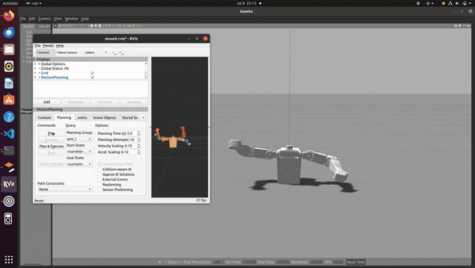

# Gazebo Simulation for FLO Robot

This directory contains the necessary files to simulate the FLO robot in Gazebo. This allows for testing and development in a virtual environment.

## description

The flov2tag package stores the model and its physical parameters.

The test_moveit package sets up the ROS controller and MoveIt.


## Usage

1. Clone the repository.
2. Place the `gazebo_simulation` directory into your ROS workspace, typically `~/catkin_ws/src/`.
3. Navigate to your ROS workspace:
   ```sh
   cd ~/catkin_ws
4. Build the workspace:
    ```sh
    catkin_make
5. Source the workspace:
    ```sh
    source devel/setup.bash
6. Enable roscore:
    ```sh
    roscore
7. Launch the simulation:
    ```sh
    roslaunch test_moveit full_robot_arm_sim.launch

## Example
Below is an example of controlling the robot arm in Gazebo with MoveIt and RViz:


## Issues
Currently, the robot model can only be controlled using RViz.

## Ongoing Improvements and Future Plans

Write code to control the robot model programmatically.
Export data from MoveIt and send it to a real robotic arm for further control.
