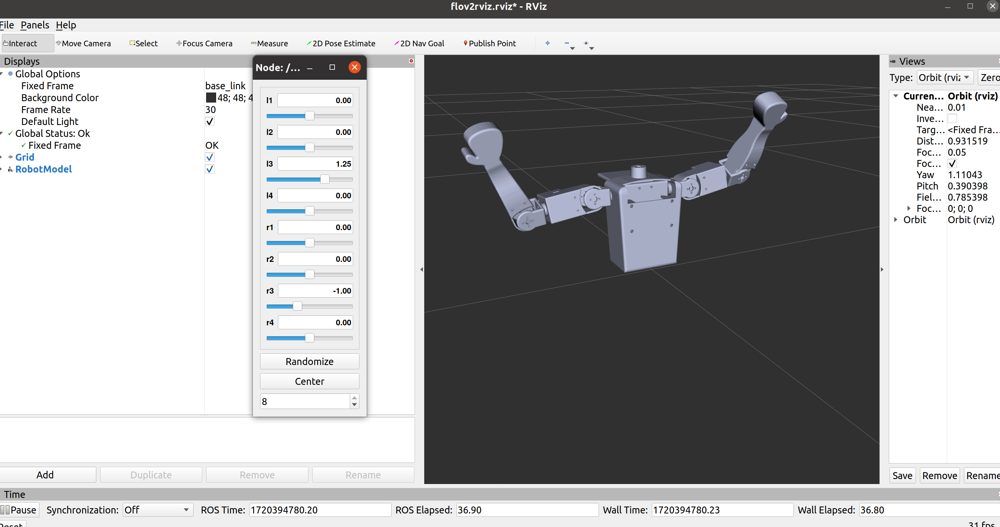

# Gazebo Simulation for FLO Robot

This directory contains the necessary files to simulate the FLO robot in Gazebo. This allows for testing and development in a virtual environment.

## Usage

1. Clone the repository.
2. Place the `gazebo_simulation` directory into your ROS workspace, typically `~/catkin_ws/src/`.
3. Navigate to your ROS workspace:
   ```sh
   cd ~/catkin_ws
4. Build the workspace:
    ```sh
    catkin_make
5. Source the workspace:
    ```sh
    source devel/setup.bash
6. Launch the Gazebo simulation:
    ```sh
    roslaunch flov2 gazebo.launch
7. To launch the RViz simulation:
    ```sh
    roslaunch flov2 display.launch

## Example
Below is an example of what the simulation environment looks like in RViz:


## Issues
Currently, the robotic arm model cannot move in Gazebo.

## Ongoing Improvements and Future Plans

Use MoveIt! to control the robotic arm in Gazebo simulation (the end-effector has some issues that need to be fixed in the model).

Write Xacro files to improve the modularity and reusability of the robot description.