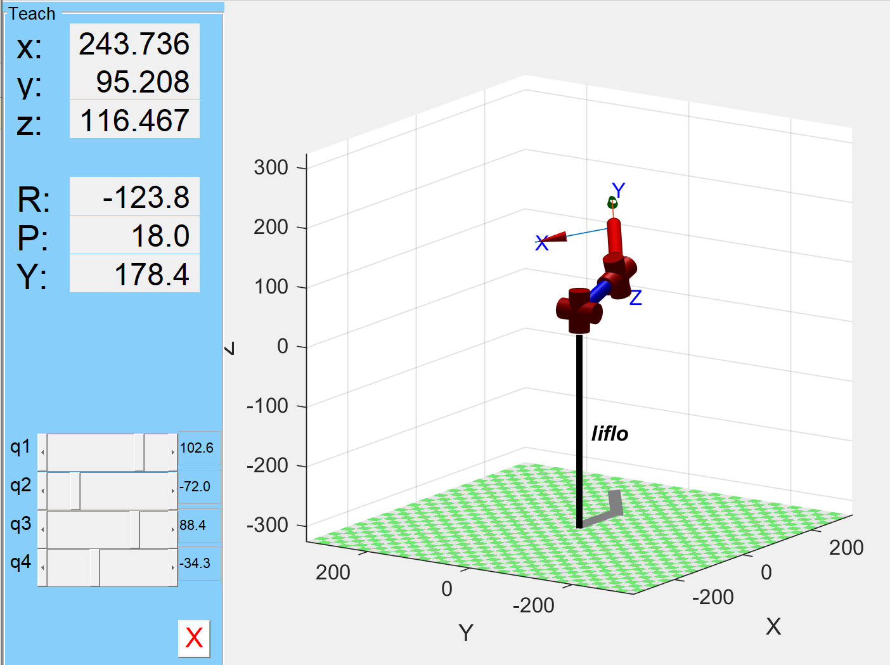

# MATLAB Robotics Scripts

This repository contains three MATLAB scripts for robotic kinematics and dynamics calculations. These files are specifically designed for the FLO_V2 robotic arm. Note that the parameters in these scripts should be modified according to the specific parameters of your robotic arm.

## Files

### 1. `MDH.m`
This script sets up the robot's Modified Denavit-Hartenberg (MDH) parameters and initializes the serial-link manipulator.

### 2. `forward.m`
This script performs forward kinematics calculations using the MDH parameters.

### 3. `inverse.m`
This script calculates the inverse kinematics for the robotic manipulator.

## Usage

1. Clone the repository.
2. Open MATLAB and navigate to the directory containing the scripts.
3. Run the scripts in the following order:
   - `MDH.m` to set up the robot.
   - `forward.m` for forward kinematics.
   - `inverse.m` for inverse kinematics.

## Note

These files are intended for use with the FLO_V2 robotic arm. Make sure to modify the parameters in the scripts according to the specific parameters of your robotic arm.

## Acknowledgments

- The Robotics Toolbox for MATLAB by Peter Corke.
